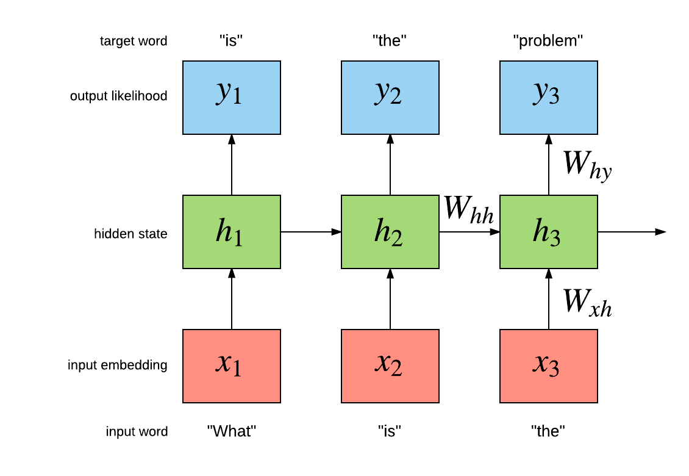

<!---# Noise contrastive estimation for the Google billion words dataset -->

 * [Word versus character level language models](#nce.char)
 * [Recurrent neural network language models](#nce.rnnlm)
 * [Loading the Google billion words dataset](#nce.gbw)
 * [Building a multi-layer LSTM](#nce.lstm)
 * [Training and evaluation scripts](#nce.script)
 * [Results](#nce.result)
 * [References](#nce.ref)

In this Torch blog post, we use noise contrastive estimation (NCE) [[2]](#nce.ref)
to train a multi-GPU recurrent neural network language model (RNNLM) 
on the Google billion words (GBW) dataset [[7]](#nce.ref). 
This blog post is the result of many months of work. 
The enormity of the dataset caused us to contribute some novel open-source modules, criteria and even a multi-GPU tensor.
We also provide scripts so that you can train and evaluate your own language models.

<a name='nce.char'></a>
## Word versus character level language models

In recent months you may have noticed increased interest in generative character-level 
RNNLMs like [char-rnn](https://github.com/karpathy/char-rnn)
and the more recent [torch-rnn](https://github.com/jcjohnson/torch-rnn).
These models are very interesting as they can be used to generate sequences of characters like the following:

```lua
<post>
Diablo
<comment score=1>
I liked this game so much!! Hope telling that numbers' benefits and 
features never found out at that level is a total breeze 
because it's not even a developer/voice opening and rusher runs 
the game against so many people having noticeable purchases of selling 
the developers built or trying to run the patch to Jagex.
</comment>
``` 

The above was generated one character at a time using a sample of [reddit](https://www.reddit.com/) comments. 
As you can see for yourself, the general structure of the generated text looks good, at first view.
The tags are opened and closed appropriately. The first sentence looks good: `I liked this game so much!!`
and it is related to the subreddit of the post: `Diablo`. But reading the rest of it, we can 
start to see the limitations of char-level language models. The spelling of individual words looks great, but 
the meaning of the next sentence is difficult to understand (it is also very long).

In this blog post we will show how Torch can be used to train a large-scale word-level language model to generate 
independent sentences. Word-level models have an important advantage over char-level models. 
Take the following sequence as an example (a quote from Robert A. Heinlein):

```
Progress isn't made by early risers. It's made by lazy men trying to find easier ways to do something.
``` 

After tokenization, the word-level model might view this sequence as containing 22 tokens.
On the other hand, the char-level will view this sequence as containing 102 tokens.
This longer sequence makes the task of the char-level model harder than the word-level model, as it 
must take into account dependencies between more tokens over more time-steps.[[8]](#nce.ref)

The main advantage of char-level over word-level language models is that they 
have a really small vocabulary. For example, the GBW dataset will contain approximately 800 characters
compared to 800,000 words (after pruning low-frequency tokens). In practice this means that char-level models will 
require less memory and have faster inference than their word-level counterparts.

<a name='nce.rnnlm'></a>
## Recurrent neural network language models

Our task is to build a language model which maximizes the likelihood of the 
next word given the history of previous words in the sentence. 
The following figure illustrates the a simple recurrent neural network (Simple RNN) language model:



For this particular example, the model should maximize "is" given "what", and then "the" given "is" and so on.
The Simple RNN has an internal hidden state `h[t]` which summarizes the sequence fed in so far, as it relates to maximizing the following target words.
Simple RNNs are not the only kind of model that can be used model language.
There are also the more advanced Long Short Term Memory (LSTM) models [[3],[4],[5]](#nce.ref), which 
have special gated cells that facilitate the backpropagation of gradients through longer sequences.
LSTMs can learn dependencies seperated between much longer time-steps.
Like convolutions, these LSTM layers can also be stacked to form deeper models.
In the Building 

<a name='nce.gbw'></a>
## Loading the Google billion words dataset

For our word-level language model we use the GBW dataset.
The dataset is different from Penn Tree Bank in that sentences are 
kept independent of each other. So then our dataset consists of a set of 
independent variable-length sequences. The dataset can be easily loaded using 
the [dataload](https://github.com/Element-Research/dataload) package:

```lua
local dl = require 'dataload'
local train, valid, test = dl.loadGBW(batchsize)
``` 

The above will automatically download the data if not found on disk and 
return the training, validation and test set. 
These are [dl.MultiSequence](https://github.com/Element-Research/dataload#dl.MultiSequence) instances
which have the following constructor:

```lua
dataloader = dl.MultiSequence(sequences, batchsize)
``` 

The `sequences` argument is a Lua table or [tds.Vector](https://github.com/torch/tds#d--tdsvec--tbl)
where each element is a Tensor containing an independent sequence. For example:

```lua
sequences = {
  torch.LongTensor{424,158,115,667,28,505,228},
  torch.LongTensor{389,456,188},
  torch.LongTensor{77,172,760,687,552,529}
}
batchsize = 2
dataloader = dl.MultiSequence(sequences, batchsize)
``` 

Note how the sequences vary in length. 
Like all [dl.DataLoader](https://github.com/Element-Research/dataload#dl.DataLoader) sub-classes, the 
`dl.MultiSequence` loader provides a method for sub-sampling a batch of `inputs` and `targets` from the dataset:

```lua
local inputs, targets = dataloader:sub(1, 10)
``` 

The `sub` method takes the `start` and `end` indices of sub-sequences to index. 
Internally, these indices are only used to determine length (`seqlen`) of the requested multi-sequences.
Each successive call to `sub` will return multi-sequences contiguous to the previous ones.

The returned `inputs` and `targets` are `seqlen x batchsize [x inputsize]` 
tensors containg a batch of 2 multi-sequences, each containing 8 time-steps.
Starting with the `inputs` :

```lua
print(inputs)
  0    0
 424   77
 158  172
 115  760
 667  687
  28  552
 505    0
   0  424
[torch.DoubleTensor of size 8x2]
``` 

Each column is vector containing potentially multiple sequences, i.e. a multi-sequence.
Independent sequences are seperated by zeros. We will see later how the 
[rnn](https://github.com/Element-Research/rnn) package can use these zero-masked time-steps to
efficiently forget its hidden state between independent sequences, at the granularity of columns.
For now, notice how the original `sequences` are contained in the returned `inputs` and separated by zeros.

The `targets` are similar to the `inputs`, but use masks of 1 to separate sequences (as `ClassNLLCriterion` will otherwise complain).
As is typical in language models, the task is to predict the next word, such that the `targets` are delayed by one time-step 
with respect to the commensurate `inputs`:

```lua
print(targets)
   1    1
 158  172
 115  760
 667  687
  28  552
 505  529
 228    1
   1  158
[torch.DoubleTensor of size 8x2]
``` 

The `train`, `valid` and `test` returned by the call to `dl.loadGBW` have the same properties as the above.
Except that the dataset is much bigger (it has one billion words). For debugging and such, we can choose to 
load a smaller subset of the training set. This will load much faster than the default training set file:

```lua
local train, valid, test = dl.loadGBW({2,2,2}, 'train_tiny.th7')
``` 

The above will use a `batchsize` of 2 for all sets.
Iteration through the dataloader is made easier using the [subiter](https://github.com/Element-Research/dataload#iterator-subiterbatchsize-epochsize-) :

```
local seqlen, epochsize = 3, 10
for i, inputs, targets in train:subiter(seqlen, epochsize) do
   print("T = " .. i)
   print(inputs)
end
``` 

Which will output:

```lua
T = 3	      
 0       0
 793470  793470
 211427    6697
[torch.DoubleTensor of size 3x2]

T = 6	 
 477149  400396
 720601  213235
 660496  368322
[torch.DoubleTensor of size 3x2]

T = 9	 
 676607   61007
 161927  767587
 248714  635004
[torch.DoubleTensor of size 3x2]

T = 10	 
 280570  130510
[torch.DoubleTensor of size 1x2]

``` 

We could also return the above batches as one big chunk instead:

```lua
train:reset() -- resets the internal sequence iterator
print(train:sub(1,10))
      0       0
 793470  793470
 211427    6697
 477149  400396
 720601  213235
 660496  368322
 676607   61007
 161927  767587
 248714  635004
 280570  130510
[torch.DoubleTensor of size 10x2]
``` 

Notice how the above small batches are aligned with this big chunk. Which 
means that the data is iterated in sequence.

Each sentence in the GBW dataset is encapsulated by `<S>` and `</S>` tokens to indicate the 
start and end of the sequence, respectively. Each token is mapped to an integer. So for example,
you can see that `<S>` is mapped to integer `793470` in the above example.
Now that we feel confident in our dataset, lets look at the model. 

<a name='nce.lstm'></a>
## Building a multi-layer LSTM

The input layer of the the `lm` model is a lookup table :

```lua
lm = nn.Sequential()

-- input layer (i.e. word embedding space)
local lookup = nn.LookupTableMaskZero(#trainset.ivocab, opt.inputsize)
lm:add(lookup) -- input is seqlen x batchsize
``` 

A sub-class of `LookupTable`, we use the [LookupTableMaskZero](https://github.com/Element-Research/rnn#rnn.LookupTableMaskZero) 
to learn word embeddings. The main difference is that it supports zero-indexes, which are forwarded as zero-tensors.
Then we have the actual multi-layer LSTM implementation, which uses the fast [SeqLSTM](https://github.com/Element-Research/rnn#rnn.SeqLSTM) module:

```lua
local inputsize = opt.inputsize
for i,hiddensize in ipairs(opt.hiddensize) do
   local rnn = nn.SeqLSTM(inputsize, hiddensize)
   rnn.maskzero = true
   lm:add(rnn)
   if opt.dropout > 0 then
      lm:add(nn.Dropout(opt.dropout))
   end
   inputsize = hiddensize
end
``` 

The `SeqLSTM` implemention is very fast and it benchmarked by the [rnn-benchmarks](https://github.com/glample/rnn-benchmarks#lstm).
Next we split the output of the SeqLSTM (which is a `seqlen x batchsize x outputsize` Tensor) into a table containing a `batchsize x outputsize` tensor for 
each time-step:

```lua
lm:add(nn.SplitTable(1))
``` 

### Output layer bottleneck

With its small vocabulary of 10000 words, the Penn Tree Bank dataset is relatively easy to use to build word-level language models. 
The output layer is still computationally tractable for both training and inference, especially for GPUs.
For these smaller vocabularies, the output layer is basically a `Linear` followed by a `SoftMax`:

```lua
outputlayer = nn.Sequential()
   :add(nn.Linear(hiddensize, vocabsize))
   :add(nn.SoftMax())
``` 

However, when training with large vocabularies, like the 793471 words that makes up the GBW dataset ,
the output layer quickly becomes a bottle neck. 
If you are training your model with a `batchsize = 32` (number of sequences per batch) and a `seqlen = 100` 
(size of sequence to backpropagate through time),
the output of that layer will have shape `seqlen x batchsize x vocabsize`, or `32 x 100 x 793471`.
For a `FloatTensor` or `CudaTensor`, that single tensor will take up 10.156GB of memory. 
The number can be double for gradients, and doubled again as both Linear and SoftMax store a copy for the output.
If somehow you can find a way to put >40GB on a GPU (or distribute it over many), you then run in the problem of 
forward/backward propagating through that `outputlayer` in a reasonable time-frame. 

### Noise contrastive estimation

The output layer of the LM uses Noise Contrastive Estimation (NCE) to speed up training and reduce memory consumption:

```lua 
local unigram = trainset.wordfreq:float()
local ncemodule = nn.NCEModule(inputsize, #trainset.ivocab, opt.k, unigram, opt.Z)

-- NCE requires {input, target} as inputs
lm = nn.Sequential()
   :add(nn.ParallelTable()
      :add(lm):add(nn.Identity()))
   :add(nn.ZipTable()) -- {{x1,x2,...}, {t1,t2,...}} -> {{x1,t1},{x2,t2},...}

-- encapsulate stepmodule into a Sequencer
lm:add(nn.Sequencer(nn.MaskZero(ncemodule, 1)))
``` 

The [NCEModule](https://github.com/Element-Research/dpnn#nn.NCEModule) is a more efficient version of:

```lua
nn.Sequential():add(nn.Linear(inputsize, #trainset.ivocab)):add(nn.LogSoftMax())
``` 

Along with the [NCECriterion](https://github.com/Element-Research/dpnn#nn.NCECriterion), 
the `NCEModule` implements the algorithm is described in [[1]](#nce.ref). 
I won't go into the details of the algorithm as it involves a lot of math.
The way it works is that for each target word (the likelihood of which we want to maximize), 
`k` words are sampled from a noise distribution, which is typically the unigram distribution.
The `unigram`  above is a tensor of size 793470 where each element is the frequency of the commensurate word in the corpus.

Sampling from such a large distribution using something like [torch.multinomial](https://github.com/torch/torch7/blob/master/doc/maths.md#torch.multinomial)
can become a bottleneck during training. 
So we implemented a more efficient version in [torch.AliasMultinomial](https://github.com/nicholas-leonard/torchx/blob/master/AliasMultinomial.lua). 
The latter multinomial sampler requires more setup time than the former, but this isn't a problem as the unigram distribution is constant.

NCE uses the noise samples to approximate a normalization term `Z` where the output distribution is `exp(x[i])/Z` and `x[i]` is the output of the `Linear` for word `i`.
For the Softmax, which NCE tries to approximate, the `Z` is the sum over the `exp(x[i'])` over all words `i'`. 
For NCE, the `Z` is typically fixed to `Z=1`. 
Our initial experiments found that setting `Z` to `Z=N*mean(exp(x[i]))` 
(where `N` is the number of words and the `mean` is approximated over a small batch of word samples `i`)
gave much better results.

One notable aspect of NCE papers (there are many) is that they often forget to mention the importance of parameter initialization.
Setting `Z=1` is only really possible if the `NCEModule.bias` is initialized to `bias[i] = -log(N)`. 
This is what the authors of [[2]](#nce.ref) use, although it isn't mentioned in the paper (I contacted one of the authors to find out).

Sampling `k` noise samples per time-step and per batch-row means that the `NCEModule` needs to internally use something like 
[torch.baddbmm](https://github.com/torch/torch7/blob/master/doc/maths.md#torch.baddbmm) to compute the `output`.
Reference [[2]](#nce.ref) implement a faster version where the noise samples are drawn once and used for the entire batch (but still once for each time-step).
This make the code a bit faster as the more efficient [torch.addmm](https://github.com/torch/torch7/blob/master/doc/maths.md#torch.addmm) can be used.
This faster NCE version described in [[2]](#nce.ref) is the default implementation of the `NCEModule`. Sampling per batch-row can be turned on with `NCEModule.rownoise=true`.

<a name='nce.script'></a>
## Training and evaluation scripts

The experiments presented here use three scripts: two for training and one for evaluation.

### Single-GPU training script

We provide training scripts for a single gpu via the [noise-contrastive-estimate.lua](https://github.com/Element-Research/rnn/blob/master/examples/noise-contrastive-estimate.lua) script.
Running the following on a 12GB NVIDIA Titan X should resulted in a test set perplexity of 65.6 after 321 epochs:

```bash
th examples/noise-contrastive-estimate.lua --cuda --device 2 --startlr 1 --saturate 300 --cutoff 10 --progress --uniform 0.1 --seqlen 50 --batchsize 128 --trainsize 400000 --validsize 40000 --hiddensize '{250,250}' --k 400 --minlr 0.001 --momentum 0.9
``` 

The resulting model will look like this:

```lua
nn.Serial @ nn.Sequential {
  [input -> (1) -> (2) -> (3) -> output]
  (1): nn.ParallelTable {
    input
      |`-> (1): nn.Sequential {
      |      [input -> (1) -> (2) -> (3) -> (4) -> output]
      |      (1): nn.LookupTableMaskZero
      |      (2): nn.SeqLSTM
      |      (3): nn.SeqLSTM
      |      (4): nn.SplitTable
      |    }
      |`-> (2): nn.Identity
       ... -> output
  }
  (2): nn.ZipTable
  (3): nn.Sequencer @ nn.Recursor @ nn.MaskZero @ nn.NCEModule(250 -> 793471)
}
``` 

To use about one third less memory, you can set momentum of 0. 

### Evaluation script

The evaluation script can be used to measure perplexity on the test set or sample independent sentences.
To evaluate a saved model, you can use the [evaluate-rnnlm.lua](https://github.com/Element-Research/rnn/blob/master/scripts/evaluate-rnnlm.lua) script:

```bash
th scripts/evaluate-rnnlm.lua --xplogpath /home/nicholas14/save/rnnlm/gbw:uranus:1466538423:1.t7 --cuda
``` 

where you should replace `/home/nicholas14/save/rnnlm/gbw:uranus:1466538423:1.t7` with the path to your own trained model.
Evaluating on the test set can take a while as it must use the less efficient `Linear` + `SoftMax`, and thus a very small batch size (so as not to use too much memory).

The evaluation script can also be used to generate samples from the language model:

```bash
th scripts/evaluate-rnnlm.lua --xplogpath /home/nicholas14/save/rnnlm/gbw:uranus:1466790001:1.t7 --cuda --nsample 200 --temperature 0.7
``` 

The `--nsample` flag specifies how many tokens to sample. The first token input to the language model is the start-of-sentence tag (`<S>`).
When the end-of-sentence tag (`</S>`), the model's hidden states are set to zero, such that each sentence is sampled independently. 
The `--temperature` flag can be reduced to make the sampling more deterministic. 

```xml
<S> There were a number of players in the starting lineup during the season and in recent weeks , in recent years , some fans have been frustrated . </S> 
<S> WASHINGTON ( Reuters ) - The government plans to cut greenhouse gases by as much as 12 % on the global economy , a new report said . </S> 
<S> One of the most important things about the day was that the two companies had just been guilty of the same nature . </S> 
<S> " It has been as much a bit of a public service as a public organisation . </S> 
<S> In a nutshell , it 's not only the fate of the economy . </S> 
<S> It was last modified at 23.31 GMT on Saturday 22 December 2009 . </S> 
<S> He told the newspaper the prosecution had been treating the small boy as " a young man who was playing for a while . </S> 
<S> " We are astounded that our employees are not made aware of the risks and risks they are pursuing during this period of time , " he said . </S> 
<S> " I had a right to come up with the idea . </S>
``` 

### Multi-GPU training script

As can be observed in the previous section, training a 2-layer LSTM with only 250 hidden units will not yield the best
generated samples. The model needs much more capacity than what can fit on a 12GB GPU. 
The [multigpu-nce-rnnlm.lua](https://github.com/Element-Research/rnn/blob/master/examples/multigpu-nce-rnnlm.lua) script can be used
to train a model on four GPUs.

It uses the [GPU](https://github.com/torch/nn/blob/master/doc/simple.md#nn.GPU) to decorate modules such that 
all their operations and memory are hosted on a specified device. 
The `GPU` module won't parallelize kernel execution over different GPU-devices. 
But it does allow us to distribute large models over devices.

For our LM, the input word embeddings (i.e. `LookupTableMaskZero`) and output layer (i.e. `NCEModule`) take up most of the memory.
The first was pretty easy to distribute:

```lua
lm = nn.Sequential()
lm:add(nn.Convert())

-- input layer (i.e. word embedding space)
local concat = nn.Concat(3)
for device=1,2 do
   local inputsize = device == 1 and torch.floor(opt.inputsize/2) or torch.ceil(opt.inputsize/2)
   local lookup = nn.LookupTableMaskZero(#trainset.ivocab, inputsize)
   lookup.maxnormout = -1 -- prevent weird maxnormout behaviour
   concat:add(nn.GPU(lookup, device):cuda()) -- input is seqlen x batchsize
end
``` 

Basically, the embedding space is split into two tables. 
For a 2048 unit embedding space, half, i.e. 1024 units, are located on each of two devices.
We use `Concat` to concatenate them back together after a `forward`.

For the hidden layers (i.e. `SeqLSTM`), we just distribute them on the devices used by the input layer.
The hidden layers use up little memory (approximately 1GB each) so they aren't the problem. 
We locate them on the same devices as the input layer as the output layer utilizes more memory (for buffers). 

```lua
local inputsize = opt.inputsize
for i,hiddensize in ipairs(opt.hiddensize) do
   local rnn = nn.SeqLSTM(inputsize, hiddensize)
   rnn.maskzero = true
   local device = i <= #opt.hiddensize/2 and 1 or 2
   lm:add(nn.GPU(rnn, device):cuda())
   if opt.dropout > 0 then
      lm:add(nn.GPU(nn.Dropout(opt.dropout), device):cuda())
   end
   inputsize = hiddensize
end

lm:add(nn.GPU(nn.SplitTable(1), 3):cuda())
``` 

The `NCEModule` was a bit more difficult to distribute as it cannot be so easily parallelized as `LookupTableMaskZero`.
Our solution was to provide a simple [multicuda()](https://github.com/Element-Research/dpnn/blob/26edf00f7f22edd1e090619bb10528557cede4df/NCEModule.lua#L419-L439) 
method to distribute the `weight` on `gradWeight` on different devices.
This is accomplished by swaping the weight tensors for our own : [torch.MultiCudaTensor](https://github.com/nicholas-leonard/torchx/blob/master/MultiCudaTensor.lua). 
Lua has no severe type-checking system, so you can fake a tensor by creating a `torch.class` table with the same methods. 
To save time, the current version of `MultiCudaTensor` only supports the operations required by the NCEModule.
The advantage of this approach is that it requires minimal changes to the NCEModule and maintains backward compatiblity without requiring redundant code or excessive refactoring.

```lua
-- output layer
local unigram = trainset.wordfreq:float()
ncemodule = nn.NCEModule(inputsize, #trainset.ivocab, opt.k, unigram, opt.Z)
ncemodule:reset() -- initializes bias to get approx. Z = 1
ncemodule.batchnoise = not opt.rownoise
-- distribute weight, gradWeight and momentum on devices 3 and 4
ncemodule:multicuda(3,4) 

-- NCE requires {input, target} as inputs
lm = nn.Sequential()
   :add(nn.ParallelTable()
      :add(lm):add(nn.Identity()))
   :add(nn.ZipTable()) -- {{x1,x2,...}, {t1,t2,...}} -> {{x1,t1},{x2,t2},...}

-- encapsulate stepmodule into a Sequencer
local masked = nn.MaskZero(ncemodule, 1):cuda()
lm:add(nn.GPU(nn.Sequencer(masked), 3, opt.device):cuda())
``` 

To reproduce the results in [[2]](#nce.ref) run the following:

```bash
th examples/multigpu-nce-rnnlm.lua --startlr 0.7 --saturate 300 --minlr 0.001 --cutoff 10 --progress --uniform 0.1 --seqlen 50 --batchsize 128 --trainsize 400000 --validsize 40000 --hiddensize '{2048,2048,2048,2048}' --dropout 0.2 --k 400 --Z 1 --momentum -1
``` 

Notable differences to paper are the following:
 * we use a [gradient norm clipping](https://github.com/Element-Research/dpnn#nn.Module.gradParamClip) [[3]](#nce.ref) (with a `cutoff` norm of 10) to counter exploding and vanishing gradient;
 * they use an adaptive learning rate schedule (which isn't specified in the paper). We linearly decay from a learning rate of 0.7 (which they also start from) such that it reaches 0.001 after 300 epochs;
 * we use `k=400` samples whereas they use `k=100`. Why? I didn't see a major drop in speed, so why not?
 * we use a sequence length of `seqlen=50` for Truncated BPTT. They use 100 (again, not in the paper). The average length of sentences in the dataset is 27 so 50 is more than enough.

Like them, we use a `dropout=0.2` between LSTM layers.
This is what the resulting model looks like:

```lua
nn.Serial @ nn.Sequential {
  [input -> (1) -> (2) -> (3) -> output]
  (1): nn.ParallelTable {
    input
      |`-> (1): nn.Sequential {
      |      [input -> (1) -> (2) -> (3) -> (4) -> (5) -> (6) -> (7) -> (8) -> (9) -> (10) -> (11) -> (12) -> output]
      |      (1): nn.Convert
      |      (2): nn.GPU(2) @ nn.Concat {
      |        input
      |          |`-> (1): nn.GPU(1) @ nn.LookupTableMaskZero
      |          |`-> (2): nn.GPU(2) @ nn.LookupTableMaskZero
      |           ... -> output
      |      }
      |      (3): nn.GPU(2) @ nn.Dropout(0.2, busy)
      |      (4): nn.GPU(1) @ nn.SeqLSTM
      |      (5): nn.GPU(1) @ nn.Dropout(0.2, busy)
      |      (6): nn.GPU(1) @ nn.SeqLSTM
      |      (7): nn.GPU(1) @ nn.Dropout(0.2, busy)
      |      (8): nn.GPU(2) @ nn.SeqLSTM
      |      (9): nn.GPU(2) @ nn.Dropout(0.2, busy)
      |      (10): nn.GPU(2) @ nn.SeqLSTM
      |      (11): nn.GPU(2) @ nn.Dropout(0.2, busy)
      |      (12): nn.GPU(3) @ nn.SplitTable
      |    }
      |`-> (2): nn.Identity
       ... -> output
  }
  (2): nn.ZipTable
  (3): nn.GPU(3) @ nn.Sequencer @ nn.Recursor @ nn.MaskZero @ nn.NCEModule(2048 -> 793471)
}
``` 

<a name='nce.result'></a>
## Results

On the 4-layer LSTM with 2048 hidden units, [[1]](#nce.ref) obtain 43.2 perplexity on the GBW test set. 
After early-stopping on a sub-set of the validation set (at 100 epochs of training where 1 epoch is 128 sequences x 400k words/sequence), our model was able to reach *40.61* perplexity.

This model was run on 4x12GB NVIDIA Titan X GPUs. 
Training requires approximately 40GB of memory, distributed across the 4 GPU devices.
As in the original paper, we do not make use of momentum as it provides little benefit and requires 1/2 more memory.

Training runs at about 3800 words/second.

### Generating Sentences

Here are 8 sentences sampled independently from the 4-layer LSTM with a `temperature` or 0.7:

```xml
<S> The company said its net profit rose to $ 289 million , or 96 cents per share , in the three months ended on March 31 compared with $ 173 million , or $ 0.68 a share , a year ago . </S>
<S> But I 've been a bit disappointed with our performance , " said Wenger . </S>
<S> The first is an even bigger problem . </S>
<S> The next big thing for him is he will be able to tell the world he is thinking about his future . </S>
<S> The new rules have been added to the legislation so that they don 't have to be approved for public use . </S>
<S> The Pentagon 's top counter-terrorism official , who has been in charge of a new system of intelligence collection and inspection , wrote in an e-mail message that while the new system could be easily implemented , it remains an option . </S>
<S> " I was trying to get a glass of water . </S>
<S> Later he was driven to a nearby house where he was later found to be severely ill . </S>
``` 


### Learning Curves


<a name='nce.ref'></a>
## References

1. *A Mnih, YW Teh*, [A fast and simple algorithm for training neural probabilistic language models](https://www.cs.toronto.edu/%7Eamnih/papers/ncelm.pdf)
2. *B Zoph, A Vaswani, J May, K Knight*, [Simple, Fast Noise-Contrastive Estimation for Large RNN Vocabularies](http://www.isi.edu/natural-language/mt/simple-fast-noise.pdf)
3. *R Pascanu, T Mikolov, Y Bengio*, [On the difficulty of training Recurrent Neural Networks](http://www.jmlr.org/proceedings/papers/v28/pascanu13.pdf)
4. *S Hochreiter, J Schmidhuber*, [Long Short Term Memory](http://web.eecs.utk.edu/~itamar/courses/ECE-692/Bobby_paper1.pdf)
5. *A Graves, A Mohamed, G Hinton*, [Speech Recognition with Deep Recurrent Neural Networks](http://arxiv.org/pdf/1303.5778.pdf)
6. *K Greff, RK Srivastava, J Koutník*, [LSTM: A Search Space Odyssey](http://arxiv.org/pdf/1503.04069)
7. *C Chelba, T Mikolov, M Schuster, Q Ge, T Brants, P Koehn, T Robinson*, [One billion word benchmark for measuring progress in statistical language modeling](http://arxiv.org/pdf/1312.3005)
8. *A Graves*, [Generating Sequences With Recurrent Neural Networks](http://arxiv.org/pdf/1308.0850v5.pdf)
