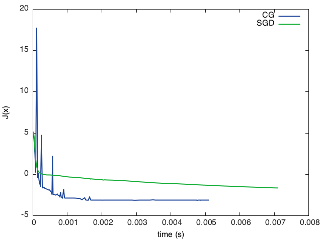

Here are five simple hands-on steps, to get started with Torch!
This tutorial supposes the package `torch` is already required via

```lua
require 'torch'
```

or that you are using the REPL `th` (which requires it automatically).

## 1. Define a positive definite quadratic form

We rely on a few torch functions here:

- `rand()` which creates tensor drawn from uniform distribution
- `t()` which transposes a tensor (note it returns a new view)
- `dot()` which performs a dot product between two tensors
- `eye()` which returns a identity matrix
- `*` operator over matrices (which performs a matrix-vector or matrix-matrix multiplication)

We first make sure the random seed is the same for everyone

```lua
torch.manualSeed(1234)
```

```lua
-- choose a dimension
N = 5

-- create a random NxN matrix
A = torch.rand(N, N)

-- make it symmetric positive
A = A*A:t()

-- make it definite
A:add(0.001, torch.eye(N))

-- add a linear term
b = torch.rand(N)

-- create the quadratic form
function J(x)
   return 0.5*x:dot(A*x)-b:dot(x)
end
```

Printing the function value (here on a random point) can be easily done with:

```lua
print(J(torch.rand(N)))
```

## 2. Find the exact minimum


We can inverse the matrix (which might not be numerically optimal)

```lua
xs = torch.inverse(A)*b
print(string.format('J(x^*) = %g', J(xs)))
```

## 3. Search the minimum by gradient descent

We first define the gradient w.r.t. `x` of `J(x)`:

```lua
function dJ(x)
  return A*x-b
end
```

We then define some current solution:

```lua
x = torch.rand(N)
```

And then apply gradient descent (with a given learning rate `lr`) for a while:

```lua
lr = 0.01
for i=1,20000 do
  x = x - dJ(x)*lr
  -- we print the value of the objective function at each iteration
  print(string.format('at iter %d J(x) = %f', i, J(x)))
end
```

You should see

```
...
at iter 19995 J(x) = -3.135664
at iter 19996 J(x) = -3.135664
at iter 19997 J(x) = -3.135665
at iter 19998 J(x) = -3.135665
at iter 19999 J(x) = -3.135665
at iter 20000 J(x) = -3.135666
```

## 4. Using the optim package

Want to use more advanced optimization techniques, like conjugate gradient
or LBFGS? The `optim` package is there for that purpose!  First, we need to
install it:

```sh
luarocks install optim
```

#### A word on local variables

In practice, it is *never* a good idea to use global variables. Use `local` at
everywhere. In our examples, we have defined everything in global, such that
they can be cut-and-pasted in the interpreter command line.
Indeed, defining a local like:

```lua
local A = torch.rand(N, N)
```

will be only available to the current scope, which, when running the interpreter, is limited
to the current input line. Subsequent lines would not have access to this local.

In lua one can define a scope with the `do...end` directives:

```lua
do
   local A = torch.rand(N, N)
   print(A)
end
print(A)
```

If you cut-and-paste this in the command line, the first print will be a
5x5 matrix (because the local `A` is defined for the duration of the scope
`do...end`), but will be `nil` afterwards.

#### Defining a closure with an upvalue

We need to define a closure which returns both `J(x)` and `dJ(x)`.  Here we
define a scope with `do...end`, such that the local variable `neval` is an
upvalue to `JdJ(x)`: only `JdJ(x)` will be aware of it.  Note that in a
script, one would not need to have the `do...end` scope, as the scope of
`neval` would be until the end of the script file (and not the end of the
line like the command line).

```lua
do
   local neval = 0
   function JdJ(x)
      local Jx = J(x)
      neval = neval + 1
      print(string.format('after %d evaluations J(x) = %f', neval, Jx))
      return Jx, dJ(x)
   end
end
```

#### Training with optim

The package is not loaded by default, so let's require it:

```lua
require 'optim'
```

We first define a state for conjugate gradient:

```lua
state = {
   verbose = true,
   maxIter = 100
}
```

and now we train:

```lua
x = torch.rand(N)
optim.cg(JdJ, x, state)
```

You should see something like:

```
after 120 evaluation J(x) = -3.136835
after 121 evaluation J(x) = -3.136836
after 122 evaluation J(x) = -3.136837
after 123 evaluation J(x) = -3.136838
after 124 evaluation J(x) = -3.136840
after 125 evaluation J(x) = -3.136838
```

## 5. Plot

Plotting can be achieved in various ways. For example, one could use the
recent [iTorch](https://github.com/facebook/iTorch) package. Here, we are
going to use `gnuplot`.

```sh
luarocks install gnuplot
```

### Store intermediate function evaluations

We modify slightly the closure we had previously, such that it stores
intermediate function evaluations (as well as the real time it took to
train so far):

```lua
evaluations = {}
time = {}
timer = torch.Timer()
neval = 0
function JdJ(x)
   local Jx = J(x)
   neval = neval + 1
   print(string.format('after %d evaluations, J(x) = %f', neval, Jx))
   table.insert(evaluations, Jx)
   table.insert(time, timer:time().real)
   return Jx, dJ(x)
end
```

Now we can train it:

```lua
state = {
   verbose = true,
   maxIter = 100
}

x0 = torch.rand(N)
cgx = x0:clone() -- make a copy of x0
timer:reset()
optim.cg(JdJ, cgx, state)

-- we convert the evaluations and time tables to tensors for plotting:
cgtime = torch.Tensor(time)
cgevaluations = torch.Tensor(evaluations)
```

### Add support for stochastic gradient descent

Let's add the training with stochastic gradient, using `optim`:

```lua
evaluations = {}
time = {}
neval = 0
state = {
  lr = 0.1
}

-- we start from the same starting point than for CG
x = x0:clone()

-- reset the timer!
timer:reset()

-- note that SGD optimizer requires us to do the loop
for i=1,1000 do
  optim.sgd(JdJ, x, state)
  table.insert(evaluations, Jx)
end
  
sgdtime = torch.Tensor(time)
sgdevaluations = torch.Tensor(evaluations)
```

### Final plot

We can now plot our graphs. A first simple approach is to use `gnuplot.plot(x, y)`.
Here we precede it with `gnuplot.figure()` to make sure plots are on different figures.

```lua
require 'gnuplot'
```

```lua
gnuplot.figure(1)
gnuplot.title('CG loss minimisation over time')
gnuplot.plot(cgtime, cgevaluations)

gnuplot.figure(2)
gnuplot.title('SGD loss minimisation over time')
gnuplot.plot(sgdtime, sgdevaluations)
```

A more advanced way, which plots everything on the same graph would be the following. Here we save everything
in a PNG file.

```lua
gnuplot.pngfigure('plot.png')
gnuplot.plot(
   {'CG',  cgtime,  cgevaluations,  '-'},
   {'SGD', sgdtime, sgdevaluations, '-'})
gnuplot.xlabel('time (s)')
gnuplot.ylabel('J(x)')
gnuplot.plotflush()
```



